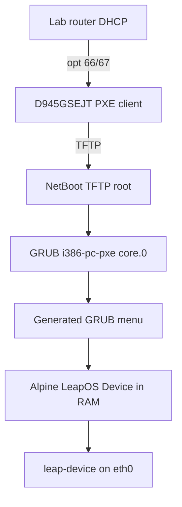

# NetBoot Server Architecture

## Boot flow



The NetBoot server itself is also a D945GSEJT board running the `alpine-i386`
image. The lab router provides DHCP; the server provides TFTP, HTTP boot files,
and the Web UI/API.

## Storage layout (on server)

```
/var/lib/leap-netboot/
  tftp/                          # TFTP root (also exported as /httpboot/)
    ipxe.pxe                     # optional iPXE loader, from fetch-ipxe.sh
    boot/grub/i386-pc/core.0     # default D945 GRUB PXE loader
    boot/grub/grub.cfg           # generated
    ipxe/menu.ipxe               # generated default menu
    ipxe/by-mac/aa-bb-cc-dd-ee-ff.ipxe
    images/<image-id>/           # PXE payloads
  state/
    images.json                  # image catalog
    devices.json                 # MAC → image assignment
    settings.json                # default image, server label
    boot_events.json             # optional boot inventory reported by clients
```

## Management API

Python daemon `leap_netbootd` listens on `127.0.0.1:8081`. Nginx proxies `/api/v1/*`.

After any change to images or devices, the daemon runs `scripts/render-pxe.sh` to
regenerate GRUB and iPXE menus.

## Image types

| type | File | Boot method |
|------|------|-------------|
| `rtems-multiboot` | `leap-port.exe` | GRUB `multiboot` with kernel args |
| `alpine-linux` | `vmlinuz-lts`, `initramfs-lts`, `modloop-lts`, `leap-device.apkovl.tar.gz` | GRUB `linux`/`initrd`; modloop/apkovl over HTTP |
| `file` | any | Listed in UI; extend render script for custom entries |

The current default image is the bundled Alpine LeapOS Device PXE image,
preseeded as `leapdevice001` by `NetbootServer/alpine-i386/build-d945-lab.sh`.
RTEMS Multiboot remains supported for experiments but is not the default lab
client path.

## Device cluster workflow

1. Build and flash `leap-netboot-server-d945.img` to the D945 NetBoot server.
2. Configure router option 66 to the server IP and option 67 to `boot/grub/i386-pc/core.0`.
3. Add each bench unit in the Web UI (MAC + friendly label) when per-device mapping is needed.
4. Assign an image or rely on the default `leapdevice001`.
5. PXE boot D945 client boards.

MAC format in JSON: lowercase hex with colons (`24:15:10:b0:5f:bc`). Filenames use
hyphens (`24-15-10-b0-5f-bc.ipxe`).
