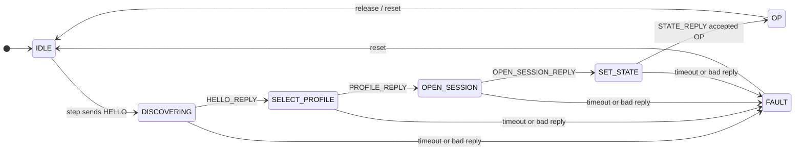

# LEAP Controller Stack — Design Plan

Status: Draft (May 2026)  
Goal: Mirror `leap_device_stack` with a transport-agnostic controller-side
integration layer for discovery, directory, MGMT bootstrap, and cyclic PD.

---

## 1. Problem

Today the Linux example (`controller_main.c`) owns ~300 lines of sequential
bootstrap logic:

```
HELLO → HELLO_REPLY → SELECT_PROFILE → PROFILE_REPLY →
OPEN_SESSION → OPEN_SESSION_REPLY → SET_STATE → STATE_REPLY → PD
```

Core building blocks already exist and are tested in isolation:

| Module | Role |
| --- | --- |
| `leap_mgmt_controller` | Session state, MGMT builders, reply handlers |
| `leap_dir_controller` | SELECT_PROFILE builder, PROFILE_REPLY parser |
| `leap_pd_controller` | Cyclic PD, lease maintenance, stats |
| *(missing)* | DISC request builders, inbound frame router, bootstrap FSM |

The device side solved this with **`leap_device_stack`**: one context, one
`process_frame()`, one `tick()`. The controller needs the symmetric **active**
model: drive requests, match replies, advance state.

---

## 2. Design Principles

1. **Transport-agnostic** — no sockets in the stack; I/O via callbacks (same
   pattern as `LeapPdControllerIo`).
2. **Reuse existing services** — wrap, do not rewrite, `mgmt` / `dir` / `pd`
   controller modules.
3. **Explicit FSM** — bootstrap phases are named states with documented
   transitions and status codes.
4. **Single-owner first** — v1 targets one active peer; API leaves room for a
   peer table without implementing full multi-master yet.
5. **Sync + async** — support blocking bootstrap helpers *and* a step function
   for polled / event-driven hosts (embedded, async recv loops).

---

## 3. Proposed Module Layout

```
inc/leap/
  leap_disc_controller.h      # NEW — HELLO / HELLO_REPLY helpers
  leap_controller_stack.h     # NEW — unified context + FSM API

src/
  leap_controller_stack.c     # NEW — FSM + reply dispatch
  services/disc/
    leap_disc_controller.c    # NEW — thin builders/parsers

examples/linux_loopback/
  controller_main.c           # SHRINK — transport + flags + stack calls
  leap_linux_controller_io.c  # NEW (optional) — Linux transport adapter
```

CMake: add `leap_disc_controller.c` and `leap_controller_stack.c` to `leap_core`.

---

## 4. Core Types

### 4.1 Transport I/O (`LeapControllerStackIo`)

Generalizes `LeapPdControllerIo` to all services:

```c
typedef struct LeapControllerStackIo
{
    void* user_ctx;

    int (*send_frame)(
        void*          user_ctx,
        const uint8_t* dst_mac,
        uint8_t        flags,
        uint16_t       service_id,
        uint16_t       message_type,
        uint32_t       session_id,
        uint32_t       sequence,
        uint32_t       ack_sequence,
        const uint8_t* payload,
        size_t         payload_length);

    int (*recv_frame)(
        void*          user_ctx,
        uint8_t*       src_mac,
        uint8_t*       payload_buf,
        size_t         payload_capacity,
        size_t*        payload_length,
        LeapFrameView* parsed,
        int            timeout_ms);

    uint64_t (*monotonic_us)(void* user_ctx);
} LeapControllerStackIo;
```

Linux adapter implements this using `leap_linux_send_leap_retry` /
`leap_linux_recv_leap` + `leap_frame_parse`.

PD cyclic mode continues to use `LeapPdControllerIo`; the Linux adapter can
share the same `LeapRawLinuxSocket` pointer (as today).

### 4.2 Stack context

```c
typedef struct LeapControllerStackConfig
{
    LeapMgmtControllerConfig mgmt;
    LeapPdControllerConfig   pd;
    uint32_t                 default_profile_id;
    uint32_t                 bootstrap_lease_us;
    uint32_t                 bootstrap_watchdog_us;
    int                      recv_timeout_ms;   /* per bootstrap step */
} LeapControllerStackConfig;

typedef enum LeapControllerStackPhase
{
    LEAP_CTRL_STACK_IDLE = 0,
    LEAP_CTRL_STACK_DISCOVERING,      /* HELLO sent, await HELLO_REPLY */
    LEAP_CTRL_STACK_SELECT_PROFILE,   /* await PROFILE_REPLY */
    LEAP_CTRL_STACK_OPEN_SESSION,     /* await OPEN_SESSION_REPLY */
    LEAP_CTRL_STACK_SET_STATE,        /* await STATE_REPLY */
    LEAP_CTRL_STACK_OP,               /* bootstrap complete */
    LEAP_CTRL_STACK_FAULT
} LeapControllerStackPhase;

typedef struct LeapControllerStack
{
    LeapControllerStackConfig config;
    LeapControllerStackPhase  phase;

    LeapMgmtControllerContext mgmt;
    LeapPdControllerContext   pd;

    uint8_t  peer_mac[6];
    int      peer_bound;

    /* Last bootstrap step status for diagnostics */
    LeapControllerStackStatus last_status;
} LeapControllerStack;
```

### 4.3 Status and events

```c
typedef enum LeapControllerStackStatus
{
    LEAP_CTRL_STACK_OK = 0,
    LEAP_CTRL_STACK_INVALID_ARG,
    LEAP_CTRL_STACK_IO_MISSING,
    LEAP_CTRL_STACK_SEND_FAILED,
    LEAP_CTRL_STACK_RECV_TIMEOUT,
    LEAP_CTRL_STACK_UNEXPECTED_REPLY,
    LEAP_CTRL_STACK_MGMT_ERROR,
    LEAP_CTRL_STACK_DIR_ERROR,
    LEAP_CTRL_STACK_FAULT
} LeapControllerStackStatus;

typedef struct LeapControllerStackEvent
{
    LeapControllerStackStatus status;
    LeapControllerStackPhase  phase;
    uint32_t                  flags;
    LeapDirControllerProfileInfo profile_info;
    /* populated on phase transitions */
} LeapControllerStackEvent;
```

Event flags (examples):

| Flag | When |
| --- | --- |
| `PEER_DISCOVERED` | HELLO_REPLY accepted |
| `PROFILE_SELECTED` | PROFILE_REPLY OK |
| `SESSION_OPENED` | OPEN_SESSION_REPLY OK |
| `OP_ENTERED` | STATE_REPLY → OP |
| `FAULT` | unrecoverable error |

---

## 5. Public API (v1)

### Lifecycle

```c
void leap_controller_stack_init(
    LeapControllerStack*             stack,
    const LeapControllerStackConfig* config);

void leap_controller_stack_reset(LeapControllerStack* stack);

LeapControllerStackPhase leap_controller_stack_get_phase(
    const LeapControllerStack* stack);
```

### Bootstrap — blocking (convenience)

Replaces `controller_bootstrap()`:

```c
LeapControllerStackStatus leap_controller_stack_bootstrap(
    LeapControllerStack*       stack,
    const LeapControllerStackIo* io,
    uint8_t*                   peer_mac_out);
```

Internally: loop calling `step` until `OP` or `FAULT`.

### Bootstrap — stepped (embedded / async)

```c
LeapControllerStackStatus leap_controller_stack_step(
    LeapControllerStack*        stack,
    const LeapControllerStackIo* io,
    LeapControllerStackEvent*   event);
```

One transition per call:

| Current phase | Action on step |
| --- | --- |
| `IDLE` | Send HELLO broadcast → `DISCOVERING` |
| `DISCOVERING` | Recv HELLO_REPLY, `on_hello_reply` → send SELECT_PROFILE → `SELECT_PROFILE` |
| `SELECT_PROFILE` | Recv PROFILE_REPLY → send OPEN_SESSION → `OPEN_SESSION` |
| `OPEN_SESSION` | Recv OPEN_SESSION_REPLY → send SET_STATE(OP) → `SET_STATE` |
| `SET_STATE` | Recv STATE_REPLY → `OP` |
| `OP` | No-op (return OK, phase unchanged) |

Returns `LEAP_CTRL_STACK_RECV_TIMEOUT` if recv fails; caller may retry step
(same phase) or abort.

### Inbound dispatch (runtime)

After bootstrap, async hosts may receive frames outside PD cyclic:

```c
LeapControllerStackStatus leap_controller_stack_on_frame(
    LeapControllerStack*       stack,
    const uint8_t*             src_mac,
    const LeapFrameView*       view,
    LeapControllerStackEvent*  event);
```

Routes MGMT replies (heartbeat acks, errors), unexpected DISC, etc. PD responses
during exchange mode are still handled inside `leap_pd_controller` today; v1 may
delegate EXCHANGE_REPLY parsing to PD module only.

### Cyclic OP (delegate)

No duplication — after `phase == OP`:

```c
/* Existing API, unchanged */
leap_pd_controller_run_one_cycle(&stack->pd, &stack->mgmt, &pd_io, peer_mac, ...);
```

Stack holds shared `mgmt` + `pd` contexts.

### Shutdown

```c
LeapControllerStackStatus leap_controller_stack_release(
    LeapControllerStack*       stack,
    const LeapControllerStackIo* io);
```

Builds `OWNER_RELEASE`, sends, resets to `IDLE`.

---

## 6. New Module: `leap_disc_controller`

Minimal surface — HELLO is the only DISC message the controller bootstrap uses
today:

```c
size_t leap_disc_controller_build_hello(
    uint8_t* payload, size_t capacity);

LeapDiscControllerStatus leap_disc_controller_on_hello_reply(
    const uint8_t* payload,
    size_t length,
    LeapHelloReply* out);
```

LOCATE / IDENTIFY can be added later for multi-device scan.

---

## 7. Multi-Device Path (v2 — design hooks in v1)

v1 binds **one** `peer_mac` in the stack. For multiple slaves on a segment:

```
Phase A — Discovery scan (future)
  broadcast HELLO, collect N HELLO_REPLY into LeapControllerPeerTable

Phase B — Per-device session (future)
  LeapControllerStack per peer OR stack + peer_index selector
  Independent session_id, sequence, lease per peer
```

v1 API reservations:

- Keep `peer_mac` as parameter to bootstrap (not only internal state) so a
  future `leap_controller_stack_bootstrap_peer(stack, io, mac)` is trivial.
- Do not hard-code broadcast-only discovery inside `step` without a config flag
  `single_peer_auto_select` (default 1 for loopback demo).

Suggested peer table type (header only in v1, not implemented):

```c
#define LEAP_CTRL_MAX_PEERS 16u

typedef struct LeapControllerPeerEntry
{
    uint8_t  mac[6];
    uint32_t active_profile_id;
    uint16_t device_state;
    int      reachable;
} LeapControllerPeerEntry;
```

---

## 8. State Machine Diagram



---

## 9. `controller_main.c` After Refactor (sketch)

```c
LeapControllerStack     stack;
LeapControllerStackIo   io;
LeapControllerStackConfig cfg;

leap_controller_stack_init(&stack, &cfg);
leap_linux_controller_io_init(&io, &transport);

if (leap_controller_stack_bootstrap(&stack, &io, peer_mac) != LEAP_CTRL_STACK_OK)
    return 1;

if (options.cyclic)
    leap_pd_controller_run_cyclic(&stack.pd, &stack.mgmt, &pd_io, peer_mac, &stop);
else
    leap_pd_controller_send_single_write(&stack.pd, &stack.mgmt, &pd_io, peer_mac, 0x0015);
```

Target: **`controller_main.c` under ~120 lines** (args, transport open, stack
call, cleanup).

---

## 10. Testing Plan

| Test | Type | Purpose |
| --- | --- | --- |
| `test_disc_controller.c` | Unit | HELLO build/parse |
| `test_controller_stack.c` | Unit | FSM with mock I/O — feed canned replies, assert phase transitions |
| `test_controller_stack_fault.c` | Unit | Timeouts, bad lengths, wrong message types |
| Existing `test_mgmt_controller.c` | Keep | MGMT isolation |
| Existing `test_pd_controller.c` | Keep | PD isolation |
| `wire_smoke_lo.sh` | Integration | Unchanged — validates end-to-end |

Mock I/O pattern (same as `test_pd_controller.c`):

- Record last sent service/message/payload.
- `recv_frame` returns scripted replies from a table indexed by step.

---

## 11. Implementation Phases

### Phase 1 — Foundation (1–2 days)

- [x] `leap_disc_controller.h/c`
- [x] `leap_controller_stack.h/c` with `init`, `reset`, `step`, `bootstrap`
- [x] `test_disc_controller.c`, `test_controller_stack.c`
- [x] CMake + `test_main.c` registration

### Phase 2 — Linux example (0.5 day)

- [x] `leap_linux_controller_io.c`
- [x] Replace `controller_bootstrap()` with stack API
- [ ] Verify wire smoke + manual loopback

### Phase 3 — Hardening (1 day)

- [x] `leap_controller_stack_on_frame()` for async MGMT
- [x] `leap_controller_stack_release()` graceful shutdown
- [x] Frame-level sequence tracking (future: `ack_sequence` window)
- [x] Document in README “Current capabilities”

### Phase 4 — Multi-device (later)

- [x] Peer table + discovery scan loop
- [x] `leap_controller_stack_bootstrap_peer()`
- [x] CI: two device processes, one controller scan

### Phase 5 — Concurrent sessions

- [x] `leap_controller_session_hub` — per-peer stack slots (independent session/sequence/lease)
- [x] `on_frame` demux by MAC, round-robin PD cycles
- [x] PD I/O: per-peer heartbeat payload + exchange reply filtering

---

## 12. Non-Goals (v1)

- LEAP-DIAG controller service
- Fragment transmission
- IP/routed transport
- Controller-side DIR read_directory polling (builder exists; not wired to FSM)
- Full redundant controller failover

---

## 13. Open Questions

1. **Sequence ownership** — Should `leap_controller_stack` own the MGMT
   `sequence` counter exclusively, or may PD/MGMT modules bump independently?
   *Recommendation:* stack bootstrap uses `mgmt.sequence`; PD and heartbeat
   continue via `leap_mgmt_controller_next_sequence()` as today.

2. **Blocking vs threaded recv** — Is `recv_timeout_ms` per-step sufficient?
   *Recommendation:* yes for v1; hosts with dedicated recv thread call
   `on_frame()` instead of blocking `step()`.

3. **Error responses** — Should FSM handle MGMT ERROR payloads explicitly?
   *Recommendation:* yes in Phase 3 — transition to `FAULT` with
   `error_code` surfaced in event.

---

## 14. Success Criteria

- [ ] `controller_main.c` bootstrap logic replaced by stack calls
- [ ] ≥4 new unit tests for controller stack FSM
- [ ] Wire smoke CI still passes
- [ ] No new transport code inside `src/leap_controller_stack.c`
- [ ] Public API documented in header comments mirroring `leap_device_stack.h`
