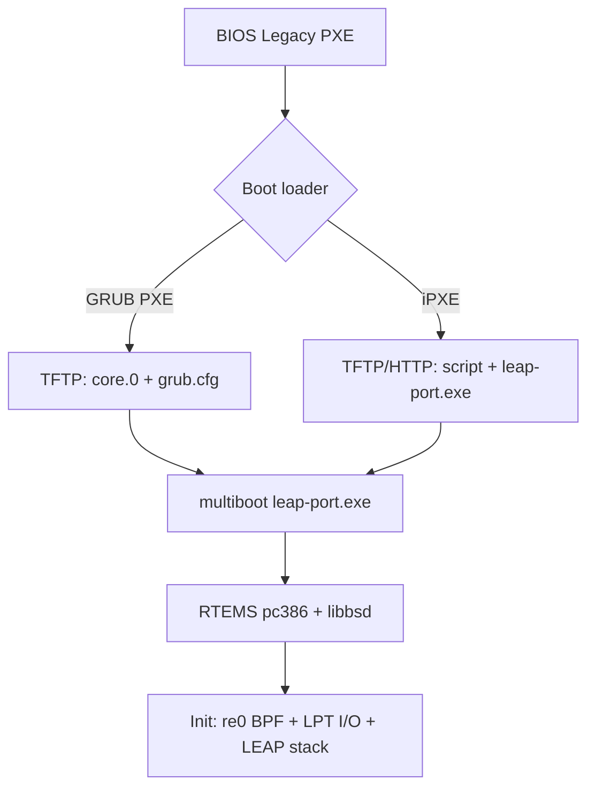

# PXE Netboot — LeapOS RTEMS Device (LeapPort)

Guide for preparing and serving a **PXE-ready Leap Device** image on the Intel
**D945GSEJT** (Atom N270) RTEMS port.

> Current lab default: D945GSEJT clients boot the **Alpine LeapOS Device PXE**
> image from `NetbootServer/alpine-i386/build-d945-lab.sh`. That path produces
> `leap-device-alpine-pxe.tar.gz`, preloads it into the D945 NetBoot server image,
> and passes Conformance Studio diskless. This document is retained for the
> optional RTEMS `leap-port.exe` Multiboot PXE path.

This document covers the **LeapPort device product** (`leap-port.exe`) only.
The LEAP gateway is Alpine Linux ([LeapGateway-linux/](../../LeapGateway-linux/))
and is not covered here.

---

## Current state

| Component | Status |
|-----------|--------|
| RTEMS Multiboot payload (`leap-port.exe`) | **Ready** — `bash rtems-build/build-leap-port.sh` |
| PXE packaging script | **Ready** — `bash rtems-build/make-pxe-device.sh` |
| Local CF/IDE image (`make-cf-image.sh`) | **Implemented** |
| USB ISO (`make-device-iso.sh`) | **Implemented** |
| DHCP/TFTP server | **External DHCP** — lab router; NetBoot server provides TFTP/HTTP |

Local boot chain today:

```
BIOS (Legacy)
  └─ GRUB i386-pc (boot.img + core.img on FAT32 CF)
       └─ multiboot /leap-port.exe
            └─ RTEMS pc386 + libbsd → LEAP device stack
```

PXE replaces only the **first two steps** with a network fetch of the same
Multiboot payload.

---

## Why the LeapPort device is a good PXE candidate

The LeapPort device image has **no persistent storage requirement**:

- No `/cf` mount
- No `config.txt` on disk
- No IDE driver needed at runtime for configuration

Once `leap-port.exe` is loaded into RAM via Multiboot, the device is fully
operational. Network configuration for LEAP uses libbsd raw L2 (BPF) on
`re0` — independent of how the OS was loaded.

---

## Prerequisites

### Host build environment (WSL/Ubuntu)

One-time RTEMS toolchain setup is documented in the LeapOS build scripts.
Minimum host packages for boot-image work:

```bash
sudo apt install -y \
  build-essential python3 python3-venv wget tar \
  grub-pc-bin grub-common xorriso \
  mtools dosfstools fdisk util-linux
```

RTEMS cross-compiler must exist at `~/rtems/6/bin/i386-rtems6-gcc`. If not:

```bash
cd /mnt/d/LEAP_Protocol/platforms/x86-32/D945GSEJT/LeapOS/rtems-build
bash setup-rtems-tree.sh    # one-time: download RTEMS 6.2 sources
bash rsb-build.sh           # one-time: build i386 toolchain + pc386 BSP
bash setup-libbsd.sh        # one-time: rtems-libbsd for re0 driver
```

### Target hardware (D945GSEJT)

| Requirement | Detail |
|-------------|--------|
| Boot mode | **Legacy BIOS** (not UEFI-only) |
| Serial console | COM1 @ **115200 8N1** (recommended for bring-up) |
| Network (runtime) | Onboard Realtek RTL8111D via libbsd `re` driver (patched in tree) |
| Network (PXE stage) | See [NIC considerations](#nic-considerations) below |

---

## Step 1 — Build the RTEMS device payload

From WSL:

```bash
cd /mnt/d/LEAP_Protocol/platforms/x86-32/D945GSEJT/LeapOS/rtems-build

# Normalize line endings if editing scripts on Windows
for f in *.sh; do sed -i 's/\r$//' "$f"; done

# Build leap-port.exe only
bash build-all.sh device
```

Output:

```
platforms/x86-32/D945GSEJT/LeapOS/rtems-image/leap-port.exe
```

Verify the binary exists and note its size (typically 1–5 MiB):

```bash
ls -lh ../rtems-image/leap-port.exe
file ../rtems-image/leap-port.exe
```

This is the **only RTEMS artifact** required on the TFTP/HTTP server. The CF
and ISO builders package this same file; PXE does not need a different build.

Optional — confirm local boot still works before PXE testing:

```bash
bash build-all.sh cf-device
# Flash leapos-device.img to CF, or test ISO:
bash build-all.sh iso-device
```

---

## Step 2 — Create a PXE staging directory

Choose a directory that your TFTP server will serve. Example layout:

```
/tftpboot/leapos-device/
  leap-port.exe              ← Multiboot RTEMS payload
  boot/grub/
    grub.cfg                 ← PXE menu (network root)
    i386-pc/
      core.0                 ← GRUB PXE loader (built in Step 3)
      *.mod                  ← GRUB modules (built in Step 3)
```

Create and populate from the RTEMS build output:

```bash
PXE_ROOT=/var/lib/tftpboot/leapos-device   # adjust to your TFTP root
RTEMS_IMAGE=/mnt/d/LEAP_Protocol/platforms/x86-32/D945GSEJT/LeapOS/rtems-image

sudo mkdir -p "$PXE_ROOT/boot/grub/i386-pc"
sudo cp "$RTEMS_IMAGE/leap-port.exe" "$PXE_ROOT/"
```

---

## Step 3 — Build GRUB for PXE (i386-pc-pxe)

Local CF images embed GRUB with **disk-only** modules:

```
multiboot part_msdos biosdisk fat fshelp serial terminal gzio relocator
```

PXE requires additional network modules. On the build host:

```bash
GRUB_DIR=/usr/lib/grub/i386-pc          # default on Ubuntu
PXE_ROOT=/var/lib/tftpboot/leapos-device

# Core PXE loader — filename must match DHCP option 67 if using BIOS PXE → GRUB
sudo grub-mkimage \
  -O i386-pc-pxe \
  -o "$PXE_ROOT/boot/grub/i386-pc/core.0" \
  -d "$GRUB_DIR" \
  -p /leapos-device/boot/grub \
  pxe tftp efinet net multiboot serial terminal gzio normal configfile echo

# Copy module files GRUB may load at runtime
sudo cp "$GRUB_DIR"/*.mod "$PXE_ROOT/boot/grub/i386-pc/"
```

Notes:

- `-p /leapos-device/boot/grub` is the **TFTP path prefix** GRUB uses to find
  `grub.cfg` and modules. Adjust if your TFTP root layout differs.
- `-O i386-pc-pxe` produces a PXE-compatible core image (not `i386-pc`).
- If `efinet` fails to load on your NIC, try BIOS PXE → **iPXE** instead
  (see [Alternative: iPXE](#alternative-ipxe-chainload)).

---

## Step 4 — Write the PXE GRUB configuration

Create `$PXE_ROOT/boot/grub/grub.cfg`. This is adapted from the local device
config at `rtems-build/grub/leapos-device-grub.cfg` but uses a TFTP root
instead of `(hd0,msdos1)`:

```grub
# LeapOS-Device PXE — D945GSEJT (Atom N270)
# Serial: COM1 @ 115200 8N1

serial --unit=0 --speed=115200 --word=8 --parity=no --stop=1
terminal_input serial console
terminal_output serial console

set default=0
set timeout=3
set root=(tftp)

menuentry "LeapOS-Device (serial COM1 @ 115200)" {
    echo "LeapOS-Device PXE: loading leap-port.exe..."
    multiboot /leapos-device/leap-port.exe \
        --video=off \
        --console=/dev/com1,115200 \
        --printk=/dev/com1,115200
    boot
}

menuentry "LeapOS-Device (VGA text)" {
    echo "LeapOS-Device PXE: loading leap-port.exe (VGA)..."
    multiboot /leapos-device/leap-port.exe \
        --video=off \
        --console=/dev/vgacons \
        --printk=/dev/vgacons \
        --disable-com1-com4
    boot
}
```

Important:

- **`--video=off`** is required on D945GSEJT — the 945GSE IGP cannot use VBE
  with the current pc386 BSP.
- Paths are relative to the TFTP server root (e.g. `/leapos-device/leap-port.exe`).
- Adjust paths if your TFTP layout differs from the example above.

Copy into place:

```bash
sudo cp grub/leapos-device-pxe-grub.cfg "$PXE_ROOT/boot/grub/grub.cfg"
# (after creating the file locally, or edit in place on the server)
```

---

## Step 5 — Configure DHCP and TFTP

PXE requires a DHCP server that tells clients where to find the boot loader.

### Option A — dnsmasq (small lab)

Install and configure on a machine on the same L2 segment as the D945GSEJT:

```bash
sudo apt install -y dnsmasq
```

Example `/etc/dnsmasq.d/leapos-device.conf` (adjust IPs and interface):

```ini
# Do not start dnsmasq if another DHCP server is on this network.
interface=eth0
bind-interfaces

dhcp-range=192.168.1.100,192.168.1.200,255.255.255.0,12h

# PXE for legacy BIOS clients
dhcp-boot=leapos-device/boot/grub/i386-pc/core.0

# TFTP
enable-tftp
tftp-root=/var/lib/tftpboot
```

Restart:

```bash
sudo systemctl restart dnsmasq
```

Ensure `$PXE_ROOT` contents live under `/var/lib/tftpboot/` as laid out in
Step 2.

### Option B — Dedicated DHCP + tftpd-hpa

| Service | Setting |
|---------|---------|
| DHCP option 66 (next-server) | IP of your TFTP host |
| DHCP option 67 (boot filename) | `leapos-device/boot/grub/i386-pc/core.0` |
| TFTP root | `/var/lib/tftpboot` |

Consult your DHCP server documentation (ISC dhcpd, Windows DHCP, router firmware).

### Option C — LeapOS NetBoot Server appliance (repo)

The D945 lab NetBoot server lives at [`NetbootServer/`](../../../../../NetbootServer/)
in the repo root. It does **not** run DHCP; configure your router per
[`NetbootServer/docs/ROUTER-DHCP.md`](../../../../../NetbootServer/docs/ROUTER-DHCP.md).

For the active diskless Alpine client path, use:

```bash
cd /mnt/d/LEAP_Protocol/NetbootServer/alpine-i386
bash build-d945-lab.sh
```

Flash `LeapOS/rtems-image/leap-netboot-server-d945.img` to the D945 NetBoot
server and set router option 67 to `boot/grub/i386-pc/core.0`.

---

## Step 6 — Configure target BIOS

On the D945GSEJT:

1. Enter BIOS setup (typically **F2** at power-on).
2. Enable **Legacy boot** (disable UEFI-only if present).
3. Enable **PXE / Network boot** on the NIC you will use.
4. Set **Network boot** as the first boot device (or use the one-time boot menu).
5. Configure **COM1** for serial redirect if available (115200 8N1).
6. Disable **TCO watchdog** if the option exists (prevents unexpected resets).

Power on with serial connected. You should see:

1. BIOS PXE initialization messages on serial or VGA
2. GRUB menu over serial (if Step 4 config is used)
3. RTEMS boot banner from `leap-port.exe`
4. libbsd bring-up and `re0` interface detection

---

## Step 7 — Verify netboot success

### Serial console (COM1 @ 115200)

Watch for the same RTEMS output as a local CF boot. A successful netboot ends
with the LEAP device stack running and BPF open on `re0`.

### On-network verification

From another host on the same segment:

```bash
# LEAP discovery (if leap-discover is available on your dev machine)
leap-discover eth0
```

The netbooted device should respond to LEAP HELLO like a CF-booted unit.

### Common failure modes

| Symptom | Likely cause |
|---------|--------------|
| DHCP timeout, no PXE | Wrong VLAN, no DHCP, or PXE disabled in BIOS |
| TFTP timeout after DHCP | Wrong `tftp-root`, firewall, or bad boot filename path |
| GRUB loads but "file not found" | Path mismatch in `grub.cfg` vs TFTP layout |
| GRUB loads, Multiboot hangs/reboots | Wrong kernel args; try serial entry with `--video=off` |
| RTEMS boots but no LEAP on wire | `re0` not up — run net-probe build separately to isolate NIC |
| Repeated reboot loops | Same as local boot — check serial for triple-fault before LEAP banner |

---

## NIC considerations

PXE boot and RTEMS runtime use **different network stacks**:

| Stage | Driver | D945GSEJT onboard RTL8111D |
|-------|--------|----------------------------|
| PXE (firmware / GRUB / iPXE) | BIOS PXE ROM, GRUB `efinet`, or iPXE | Support varies — **test in lab** |
| RTEMS runtime | libbsd `re` (patched in `apply-libbsd-re-patches.sh`) | Supported after Multiboot |

If onboard PXE fails at the GRUB stage:

1. **Use BIOS PXE ROM** — many boards chain-load without needing GRUB `efinet`.
2. **Add a PCI Intel NIC** (e100/e1000) for PXE boot; LEAP can still use `re0`
   at runtime if both NICs are present.
3. **Chainload iPXE** — better Realtek support; see below.

See also: [HARDWARE.md](HARDWARE.md) — Network section.

---

## Alternative: iPXE chainload

iPXE often handles Realtek NICs more reliably than stock GRUB PXE modules.

### Build or download iPXE

Use a prebuilt `ipxe.pxe` or compile with RTL8111 driver support from
[ipxe.org](https://ipxe.org).

### DHCP points to iPXE first

```ini
dhcp-boot=ipxe.pxe
```

### iPXE script (`/tftpboot/leapos-device.ipxe`)

```ipxe
#!ipxe
dhcp
set base-url tftp://${next-server}/leapos-device
kernel ${base-url}/leap-port.exe \
  --video=off \
  --console=/dev/com1,115200 \
  --printk=/dev/com1,115200
boot
```

Note: iPXE can also use **HTTP** instead of TFTP for faster transfers:

```ipxe
kernel http://192.168.1.10/leapos-device/leap-port.exe ...
```

Multiboot over iPXE requires iPXE built with Multiboot support — verify your
iPXE build options.

---

## Boot flow summary



---

## File reference (repo)

| Path | Role |
|------|------|
| `LeapOS/rtems-build/build-all.sh device` | Build `leap-port.exe` |
| `LeapOS/rtems-build/build-leap-port.sh` | libbsd integration build |
| `LeapOS/rtems-build/make-cf-image.sh device` | Local CF image (reference) |
| `LeapOS/rtems-build/make-device-iso.sh` | Local USB ISO (reference) |
| `LeapOS/rtems-build/grub/leapos-device-grub.cfg` | Local GRUB menu (adapt for PXE) |
| `LeapOS/rtems-build/stage-payload.sh device` | Stages payload + grub.cfg |
| `LeapOS/rtems-image/leap-port.exe` | **PXE payload** |
| `LeapPort/src/init.c` | RTEMS Init task / device stack |
| `LeapPort/src/leap_transport.c` | libbsd BPF raw L2 transport |
| `LeapOS/docs/HARDWARE.md` | Board boot and NIC notes |

---

## Future repo automation

The following are **not implemented yet** but would complete PXE support in-tree:

| Item | Purpose |
|------|---------|
| `rtems-build/grub/leapos-device-pxe-grub.cfg` | Version-controlled PXE menu |
| `rtems-build/make-pxe-device.sh` | Build GRUB PXE core + stage TFTP tree |
| `rtems-build/build-leap-port.sh` | Build `leap-port.exe` via rtems-libbsd |
| `rtems-image/pxe-device/` | Output directory for TFTP upload |

```bash
cd platforms/x86-32/D945GSEJT/LeapOS/rtems-build
bash make-pxe-device.sh --build    # rebuild leap-port.exe + stage PXE tree
bash make-pxe-device.sh            # stage only (existing leap-port.exe)
```

For the in-repo **NetBoot Server**, RTEMS can still be published manually:

```bash
NetbootServer/scripts/publish-leapos-rtems.sh \
  platforms/x86-32/D945GSEJT/LeapOS/rtems-image/leap-port.exe \
  --name "LeapOS device" --default
```

---

## Legacy manual steps (reference)

The following were the original manual procedure before `make-pxe-device.sh`:

## Quick command recap

```bash
# 1. Build RTEMS payload
cd /mnt/d/LEAP_Protocol/platforms/x86-32/D945GSEJT/LeapOS/rtems-build
bash build-all.sh device

# 2. Stage for TFTP (adjust paths)
PXE_ROOT=/var/lib/tftpboot/leapos-device
sudo mkdir -p "$PXE_ROOT/boot/grub/i386-pc"
sudo cp ../rtems-image/leap-port.exe "$PXE_ROOT/"

# 3. Build GRUB PXE loader
sudo grub-mkimage -O i386-pc-pxe \
  -o "$PXE_ROOT/boot/grub/i386-pc/core.0" \
  -d /usr/lib/grub/i386-pc \
  -p /leapos-device/boot/grub \
  pxe tftp efinet net multiboot serial terminal gzio normal configfile echo
sudo cp /usr/lib/grub/i386-pc/*.mod "$PXE_ROOT/boot/grub/i386-pc/"

# 4. Install grub.cfg (create per Step 4, then copy)
sudo cp boot/grub/grub.cfg "$PXE_ROOT/boot/grub/grub.cfg"

# 5. Configure dnsmasq / DHCP + TFTP, set BIOS to network boot, watch COM1
```

---

## Related documentation

- [HARDWARE.md](HARDWARE.md) — D945GSEJT boot media, serial, NIC notes
- [../rtems-build/check-deps.sh](../rtems-build/check-deps.sh) — host dependency check
- [../../LeapGateway-linux/alpine/README.md](../../LeapGateway-linux/alpine/README.md) — Linux gateway (separate product)
