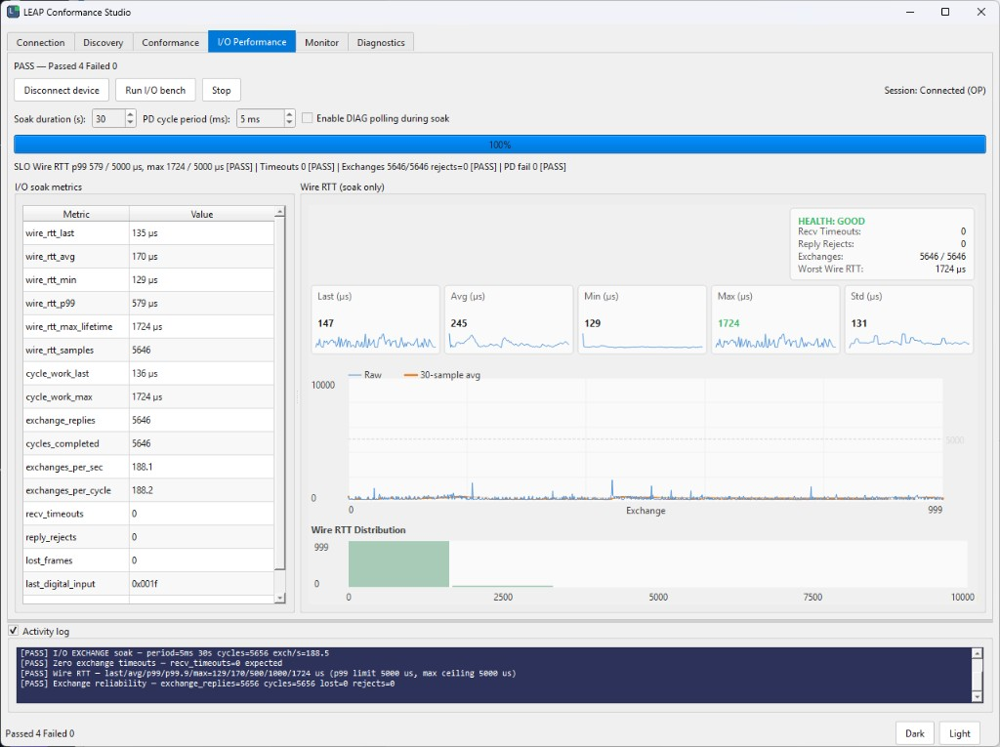

# x86-32 (RTEMS)

LEAP embedded device ports for **32-bit x86** boards running
[RTEMS](https://www.rtems.org/).

Firmware builds **inside each RTEMS waf project** — not in the repo-root CMake
trees. Pair devices on the wire with `leap_win_controller` or LEAP Conformance
Studio on Windows, or `leap_linux_controller` on native Linux.

## Targets

| Target | Path | Status |
| --- | --- | --- |
| Intel D945GSEJT (Atom, pc386 BSP) | [D945GSEJT/](D945GSEJT/) | Working — full LEAP stack on `re0`, LPT digital I/O (8 out / 5 in) |

## Conformance

The D945GSEJT port passes LEAP Conformance Studio's I/O performance soak — full
cyclic process-data exchange with zero timeouts, rejects, or lost frames.

## Why x86-32 / RTEMS

The D945GSEJT is a low-cost embedded ATX board (Intel Atom N270 + ICH7) with
onboard Realtek RTL8111D/8111DL Gigabit Ethernet. It is a practical lab platform for LEAP
conformance and soak testing at scale when many identical boards are available.

RTEMS **pc386** BSP support makes these boards a good fit for raw Layer 2
Ethernet work via **libbsd** (BPF or link-layer sockets).

## Build overview

Each target ships RTEMS projects under `<target>/`:

| Tree | Build | Output |
| --- | --- | --- |
| `LeapOS/` | `rtems-build/build-all.sh` (WSL) | `leapos-device.*` / `leapos-gateway.*` boot images |
| `LeapPort/` | `./waf` | `leap_d945gsejt.exe` (standalone app build) |

1. Install RTEMS 6.x tool chain and pc386 BSP — see [D945GSEJT/LeapOS/docs/BUILD.md](D945GSEJT/LeapOS/docs/BUILD.md).
2. Set `RTEMS_TOOLS` and `RTEMS_BSPS` (or use defaults under `~/rtems/6/`).
3. Boot image: `bash D945GSEJT/LeapOS/rtems-build/build-all.sh`
4. LEAP app: `waf configure` + `waf` in `D945GSEJT/LeapPort/`

Host-side validation uses the same Conformance Studio / `leap_win_controller`
workflow as other embedded ports.
