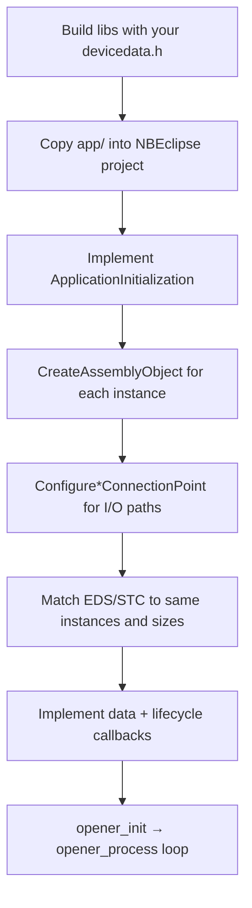

# Application developer guide

How to turn the OpENer_uC-NetBurner demo into your own EtherNet/IP adapter: device identity, assembly layout, connection points, and CIP callbacks.

For NBEclipse wiring (libs, makefile, RTOS task), start with [NetBurner integration](../porting/README.md). This guide focuses on the **product-specific** layer you replace in `sampleapplication.c` and align with EDS/STC files.

---

## What you own vs what the port owns

| Layer | Location | Your job |
|-------|----------|----------|
| RTOS entry, init/poll loop | `app/nbeclipse/main.cpp`, `app/opener.c` | Usually copy unchanged; tune task priority / stack |
| NNDK → CIP network sync | `app/networkconfig.c` | Usually copy unchanged; serial number comes from MAC |
| **Assemblies + callbacks** | `app/sample_application/sampleapplication.c` | **Replace with your I/O map** |
| Stack limits | `app/opener_user_conf.h` | Tune sessions, connection counts, tick rate |
| Compile-time identity | `devicedata.h` (CMake-generated) | Set vendor/product/name when building libs |
| Tooling artifacts | EDS + `.stc` (e.g. [`data/OpENerPC.stc`](../../../data/OpENerPC.stc)) | Regenerate for **your** identity and assemblies |

Reference implementation: [`sampleapplication.c`](../../src/ports/netburner/app/sample_application/sampleapplication.c).

---

## End-to-end flow



At runtime:

1. `opener_init()` prepares the network, optional ACD/LLDP, then `CipStackInit()` calls **`ApplicationInitialization()`**.
2. Each `opener_process()` tick runs the stack; I/O data flows through **`AfterAssemblyDataReceived`** (O→T) and **`BeforeAssemblyDataSend`** (T→O).

---

## Step 1 — Device identity

Identity is what scanners read from CIP class **0x01** (Vendor ID, Product Code, Revision, Serial Number, Product Name, status flags).

### Compile-time defaults (`devicedata.h`)

When you build OpENer libraries, CMake generates `devicedata.h` from [`devicedata.h.in`](../../src/ports/devicedata.h.in). Defaults (override with `-D` on the CMake command line):

| CMake variable | Default | CIP attribute |
|----------------|---------|---------------|
| `OpENer_Device_Config_Vendor_Id` | `1` | Vendor ID (attr 1) |
| `OpENer_Device_Config_Device_Type` | `12` | Device Type (attr 2) — Communications Adapter |
| `OpENer_Device_Config_Product_Code` | `65001` | Product Code (attr 3) |
| `OpENer_Device_Config_Device_Name` | `"OpENer Device"` | Product Name (attr 7) |
| `OpENer_Device_Major_Version` / `Minor` | project version | Revision (attr 4) |

Example Extended-profile lib build with product identity:

```powershell
cmake -S source -B build-nb `
  -DCMAKE_TOOLCHAIN_FILE=source/buildsupport/Toolchain/Toolchain-NetBurner-NNDK.cmake `
  -DOPENER_NET_BACKEND=netburner `
  -DOPENER_NNDK_ROOT=C:/nburn `
  -DOpENer_Device_Config_Vendor_Id=YOUR_VID `
  -DOpENer_Device_Config_Product_Code=YOUR_PID `
  -DOpENer_Device_Config_Device_Name="My Adapter"
cmake --build build-nb
```

Rebuild firmware after changing identity in libs — `g_identity` is initialized from these values at link time.

### Runtime updates

Public API in [`opener_api.h`](../../src/opener_api.h):

```c
SetDeviceVendorId(vendor_id);
SetDeviceProductCode(code);
SetDeviceRevision(major, minor);
SetDeviceProductName("My Adapter");
SetDeviceSerialNumber(serial);
```

The NetBurner port already sets **serial number from MAC** in `networkconfig.c` (bytes 2–5 of the interface MAC). Call the other `SetDevice*` functions from `ApplicationInitialization()` if you need runtime identity distinct from CMake defaults.

Extended **device status** (attr 6) for CT / Rockwell tools:

```c
CipIdentitySetExtendedDeviceStatus(...);  /* I/O connection / run-idle state */
CipIdentitySetStatusFlags(kConfigured);   /* set when static IP is configured */
```

The demo tracks I/O connection count in `CheckIoConnectionEvent()` and run/idle in `RunIdleChanged()`.

### Keep EDS, STC, and firmware in sync

- **Do not ship** [`data/OpENerPC.stc`](../../../data/OpENerPC.stc) unchanged — it describes the demo assemblies (100, 150, 151, …) and demo identity (`65001`, `"OpENer PC"`).
- Regenerate EDS/STC with your vendor ID, product code, revision, product name, assembly instance numbers, and byte sizes.
- STC **IAL** lines must match Identity attributes; **OPT** connection sections must match your `Configure*ConnectionPoint` triples (see demo `<06>` block in the reference STC).

---

## Step 2 — Assembly layout

An **Assembly object** (class 0x04) is a byte buffer identified by an **instance number**. Scanners connect to assemblies through **connection points** in Forward Open paths (`20 04 24 97 …` encodes instance IDs).

### Direction naming (originator-centric)

EtherNet/IP connection parameters use originator-centric names. From the **adapter (target)** perspective:

| Connection term | Adapter role | Demo callback | Typical use |
|-----------------|--------------|---------------|-------------|
| **O→T** (Originator → Target) | Scanner **writes** to you | `AfterAssemblyDataReceived` | Outputs, setpoints, commands |
| **T→O** (Target → Originator) | Scanner **reads** from you | `BeforeAssemblyDataSend` | Inputs, status, measurements |
| **Configuration** | Scanner sends once at open | `AfterAssemblyDataReceived` | Connection-specific config |

The demo names this explicitly:

```c
#define DEMO_APP_INPUT_ASSEMBLY_NUM 100   /* T→O to scanner — your inputs */
#define DEMO_APP_OUTPUT_ASSEMBLY_NUM 150  /* O→T from scanner — your outputs */
#define DEMO_APP_CONFIG_ASSEMBLY_NUM 151
```

Choose instance numbers that fit your product convention (often 100+ for I/O). They must match EDS/STC and RSLogix/CCW module definition.

### Creating assemblies

```c
static EipUint8 s_my_output_data[64];
static EipUint8 s_my_input_data[32];

CreateAssemblyObject(MY_OUTPUT_ASSEMBLY_NUM, s_my_output_data, sizeof(s_my_output_data));
CreateAssemblyObject(MY_INPUT_ASSEMBLY_NUM,  s_my_input_data,  sizeof(s_my_input_data));
```

Rules:

- **Buffer size** in `CreateAssemblyObject` is the assembly size on the wire (must match Forward Open sizes in STC).
- Pass **`NULL, 0`** for heartbeat-only placeholder assemblies (no data buffer in the device).
- Configuration assemblies use the same API; handle content in `AfterAssemblyDataReceived` and return `kEipStatusError` if config is invalid.

### Demo assembly map (starting point)

| Instance | Size | Role |
|----------|------|------|
| 100 | 32 | T→O input to scanner |
| 150 | 32 | O→T output from scanner |
| 151 | 10 | Configuration |
| 152 | 0 | Input-only heartbeat O→T placeholder |
| 153 | 0 | Listen-only heartbeat O→T placeholder |
| 154 | 32 | Explicit messaging assembly (optional) |

Replace sizes and counts for your product; add more instances if you need multiple I/O formats (create additional `CreateAssemblyObject` calls and connection points).

---

## Step 3 — Connection points

After assemblies exist, map them to **I/O connection types** the stack can accept:

```c
ConfigureExclusiveOwnerConnectionPoint(
  0,                          /* connection_number — first exclusive owner slot */
  MY_OUTPUT_ASSEMBLY_NUM,     /* O→T */
  MY_INPUT_ASSEMBLY_NUM,      /* T→O */
  MY_CONFIG_ASSEMBLY_NUM);

ConfigureInputOnlyConnectionPoint(
  0,
  HEARTBEAT_O2T_ASSEMBLY,     /* often NULL/0-size instance */
  MY_INPUT_ASSEMBLY_NUM,
  MY_CONFIG_ASSEMBLY_NUM);

ConfigureListenOnlyConnectionPoint(
  0,
  HEARTBEAT_O2T_ASSEMBLY,
  MY_INPUT_ASSEMBLY_NUM,
  MY_CONFIG_ASSEMBLY_NUM);
```

The first argument is an index from `0` to `N-1` for each connection **type**. Limits come from [`opener_user_conf.h`](../../src/ports/netburner/app/opener_user_conf.h) (override before the stack defaults):

| Macro | Demo value | Meaning |
|-------|------------|---------|
| `OPENER_CIP_NUM_EXLUSIVE_OWNER_CONNS` | 1 (default in stack config) | Exclusive owner paths |
| `OPENER_CIP_NUM_INPUT_ONLY_CONNS` | 1 | Input-only paths |
| `OPENER_CIP_NUM_LISTEN_ONLY_CONNS` | 1 | Listen-only paths |
| `OPENER_CIP_NUM_APPLICATION_SPECIFIC_CONNECTABLE_OBJECTS` | 1 | Extra connectable objects |

Increase these if you expose multiple Forward Open paths (e.g. separate produce/consume maps).

**Connection path bytes** in the scanner must match the configured instances. The reference STC documents the demo paths in the `<06>` `PossibleConnections` XML (`ePath="200424972c962c64"` etc.).

---

## Step 4 — Application callbacks

Implement all of the following in your application `.c` file (replacing `sampleapplication.c`). Signatures are in [`opener_api.h`](../../src/opener_api.h) under `CIP_CALLBACK_API`.

### `ApplicationInitialization()`

Called once from `CipStackInit()` after core objects exist, before accepting connections.

**Do here:**

- `CreateAssemblyObject()` for every instance
- `ConfigureExclusiveOwnerConnectionPoint()` / `ConfigureInputOnlyConnectionPoint()` / `ConfigureListenOnlyConnectionPoint()`
- Optional: `OpenerConfigureMicro800RunIdleCompat()` when targeting Micro800 / many Logix setups ([details](../features/MICRO800_RUN_IDLE_COMPAT.md))
- Optional: `SetDeviceProductName()` and other identity overrides

Return `kEipStatusOk` on success.

### `HandleApplication()`

Called at the start of each connection manager cycle. Keep it **short** — no heavy I/O here. Use for slow housekeeping, not cyclic process data.

### `CheckIoConnectionEvent(output_assembly_id, input_assembly_id, io_connection_event)`

Notified on I/O open, close, and timeout. Parameters identify the **connection point** assemblies.

**Typical uses:**

- Track whether any I/O connection is active (`kIoConnectionEventOpened` / `Closed` / `TimedOut`)
- Update `CipIdentitySetExtendedDeviceStatus()` for CT compliance
- When Extended tier ACD is enabled: `OpenerNbAcdNotifyIoConnection(true/false)` (demo pattern)

### `AfterAssemblyDataReceived(CipInstance *instance)`

Invoked when O→T data (including configuration) has been written into the assembly buffer.

**Typical uses:**

- Copy scanner output assembly to hardware / control logic
- Validate configuration assembly; return `kEipStatusError` to reject bad config
- Demo loopback: copies assembly 150 → 100 for bench testing

Switch on `instance->instance_number` to dispatch per assembly.

### `BeforeAssemblyDataSend(CipInstance *instance)`

Invoked immediately before a T→O production transmit.

**Typical uses:**

- Sample sensors / status into the input assembly buffer
- Return `false` to skip this production cycle (uncommon)

Default: return `true`.

### `ResetDevice()` / `ResetDeviceToInitialConfiguration()`

CIP Reset service handlers. Close connections and restore QoS / TCP/IP defaults as appropriate for your product. Demo calls `CloseAllConnections()` and resets QoS attributes.

### `RunIdleChanged(EipUint32 run_idle_value)`

Called when a **declared** Run/Idle header is present on an O→T connection. Update extended identity status for run vs idle.

If you use `OpenerConfigureMicro800RunIdleCompat()`, undeclared headers are stripped in the stack; this callback may see little use — see [Micro800 run-idle](../features/MICRO800_RUN_IDLE_COMPAT.md).

---

## Step 5 — Stack tuning (`opener_user_conf.h`)

Product copy lives at [`app/opener_user_conf.h`](../../src/ports/netburner/app/opener_user_conf.h). It must be on the include path **before** [`source/src/config/opener_user_conf.h`](../../src/config/opener_user_conf.h) (see `makefile.init.snippet`).

Common overrides:

```c
#define OPENER_NUMBER_OF_SUPPORTED_SESSIONS 4
#define OPENER_CIP_NUM_APPLICATION_SPECIFIC_CONNECTABLE_OBJECTS 1
#define OPENER_CIP_NUM_EXPLICIT_CONNECTABLE_OBJECTS 1
#define kOpenerTimerTickInMilliSeconds 50
```

`kOpenerTimerTickInMilliSeconds` must match the delay in `main.cpp` between `opener_process()` calls (default 50 ms).

---

## Step 6 — Wire your application into the build

1. Rename or replace `sampleapplication.c` with your product file; keep it in `USER_OBJS` in [`makefile.init.snippet`](../../src/ports/netburner/app/nbeclipse/makefile.init.snippet).
2. Set `OPENER_ROOT` to your OpENer checkout.
3. Build libs (`Core` or `Extended`) before linking firmware.
4. For Extended tier (LLDP/ACD CIP objects): follow [LLDP / ACD](../features/LLDP_ACD_WIRE.md) and [porting Extended steps](../porting/README.md).

---

## Checklist for a new product

- [ ] CMake identity variables set; libs rebuilt
- [ ] EDS/STC regenerated — vendor, product code, name, revision, assembly instances and sizes
- [ ] `CreateAssemblyObject` for every STC assembly instance
- [ ] `Configure*ConnectionPoint` matches STC connection paths and sizes
- [ ] `opener_user_conf.h` connection counts ≥ number of paths you expose
- [ ] `AfterAssemblyDataReceived` handles all O→T assemblies (outputs + config)
- [ ] `BeforeAssemblyDataSend` refreshes all T→O assemblies
- [ ] `CheckIoConnectionEvent` / identity extended status if targeting Rockwell CT
- [ ] `OpenerConfigureMicro800RunIdleCompat()` if targeting Micro800/Logix I/O quirks
- [ ] On-target validation per [ON_TARGET_TEST_MATRIX.md](../testing/ON_TARGET_TEST_MATRIX.md)

---

## Related docs

| Doc | Topic |
|-----|-------|
| [NetBurner integration](../porting/README.md) | Makefile, libs, Extended archive |
| [Application layer sources](../../src/ports/netburner/app/README.md) | File roles |
| [Micro800 run-idle](../features/MICRO800_RUN_IDLE_COMPAT.md) | Header compatibility |
| [LLDP / ACD](../features/LLDP_ACD_WIRE.md) | Extended tier wire modules |
| [ON_TARGET_TEST_MATRIX](../testing/ON_TARGET_TEST_MATRIX.md) | Hardware test checklist |
